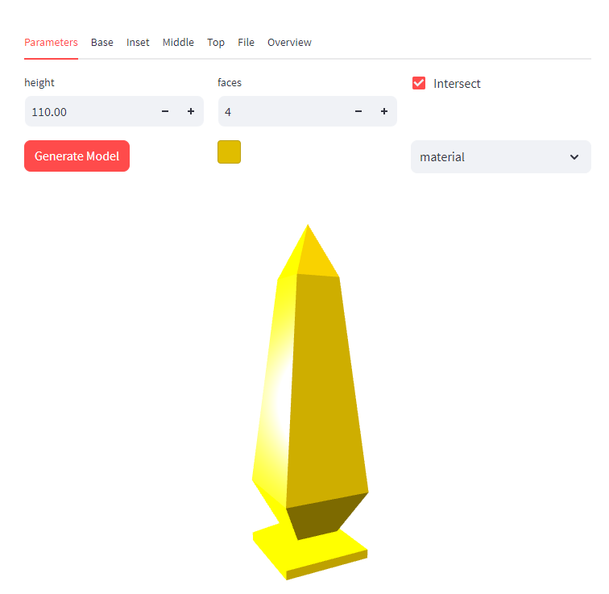

# CadQuery Ladder Terrain - Streamlit Gui

Streamlit Gui that uses my code from [cqterrain](https://github.com/medicationforall/cqterrain) to generate parametric Ladders. 



View the demo as a [Streamlit App](https://ladderterrain.streamlit.app/)


## To run Locally

1. Download the code
2. Open a command line where the code resides
3. Install streamlit
    ``` bash
    pip install streamlit
    ```
4. Install cqterrain
    ```
    pip install git+https://github.com/medicationforall/cqterrain
    ```
5. Run the streamlit app
    ```
    streamlit run app/app.py
    ```
6. If everything worked; a browser should be opened to your local instance.